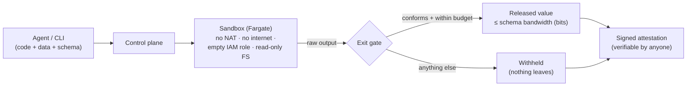

# Mark-1

**Confidential code execution with a bandwidth-bounded, attested exit.**

Run untrusted or AI-generated code on your private data in the cloud, and get back **only a small,
typed, cryptographically-attested answer** — so the data *structurally* cannot leave.

```bash
# Classify some private emails without letting the code exfiltrate them.
sbx run classify.py --data emails.csv=./emails.csv --schema schemas/label.json --local
# → status: succeeded   output: "spam"   bandwidth: 1.58 bits   attestation: att-…

# A script that tries to dump the whole dataset instead:
sbx run exfil.py --data emails.csv=./emails.csv --schema schemas/label.json --local
# → status: withheld    output does not conform to the declared schema  (nothing released)
```

## Why it's different

Isolation-first sandboxes (E2B, Modal, AWS AgentCore) stop code from **escaping the box** — they
protect the *host* from the code. They do nothing to stop code that legitimately reads your data
from **leaking** it. Mark-1 protects the **data** from the code:

- Untrusted code may return **only** a value matching a caller-declared **narrow schema** (int /
  enum / bounded string / bounded array / small object). A few-byte exit makes **bulk exfiltration
  structurally impossible** — a bandwidth argument, not a content scan that encrypt-before-emit
  defeats.
- Every run emits a **signed attestation**: *this exact code ran on this exact data with zero
  egress, and only this bounded value came out* — verifiable by anyone.
- A **cumulative exit-bandwidth budget** (`--principal alice --budget-bits 8`) caps the *total*
  bits a caller can ever extract across runs, so drip exfiltration over many conforming calls is
  bounded too — not just each run.
- Deploys into **your own AWS account** with one `terraform apply`. Designed for < ~$10/month, ≈ $0
  idle. An MCP server lets AI agents use it directly.

Built on the confinement problem (Lampson, 1973): we never claim "zero leak." We claim the leak is
**bounded to the schema you chose and disclosed in the attestation.** See [`SECURITY.md`](SECURITY.md).

## Status

The base (M0–M8) is complete and verified:

- **Local:** the full pipeline (typed exit, bandwidth accounting, exit gate, DLP backstop, ed25519
  attestation, cumulative budget) runs today via `sbx run --local`, `make demo`, and the MCP server.
- **Cloud:** proven end-to-end on real Fargate — the honest classifier's answer released and
  attested, the exfiltrator withheld and attested — inside a no-NAT private subnet with an
  endpoints-only security group and an **empty task IAM role**. The whole stack stands up with one
  `terraform apply` and tears down to zero (idle cost ≈ $0; a run costs pennies).
- **Adversarial:** `tests/hostile/` (dump, encode-in-bounded-string, stdout, fork bomb, memory hog,
  drip-exfiltration-across-runs) all structurally blocked; the MCP transport is integration-tested
  end-to-end.

Remaining work is [future scope](docs/FUTURE-SCOPE.md), not the base guarantee.

## How it fits together



<details>
<summary><b>Demo transcript</b> (<code>make demo</code> — same dataset, same schema, two programs)</summary>

```text
Mark-1 local demo — same dataset, same schema, two programs
dataset: 20279 bytes; exit schema: 3-way enum (~1.58 bits)

[honest classifier]
  status:      succeeded
  output:      'spam'
  bandwidth:   1.58 bits (max that could leave)
  attestation: att-ec16dec137624dcf8d6ac6cf285eba73  (signature VALID)

[malicious exfiltrator]
  status:      withheld
  output:      None
  withheld:    output does not conform to the declared schema: $: value not among enum choices
  bandwidth:   1.58 bits (max that could leave)
  attestation: att-72eafb3418f647918b42592f239f76bd  (signature VALID)

The dataset is ~20279 bytes; the widest the exit can carry is ~1.58 bits.
Bulk exfiltration is structurally impossible, not merely scanned-for.
```

</details>

## Use from an AI agent (MCP)

The MCP server exposes `run_confidential_tool`: an agent supplies untrusted code, the data, and a
narrow output schema, and gets back only the schema-conforming value plus an attestation id — the
same exit gate as everywhere else, so the guarantee is identical.

```bash
pip install -e '.[mcp]'
claude mcp add mark1 -- mark1-mcp        # Claude Code
```

Any other MCP host, via generic stdio config:

```json
{ "mcpServers": { "mark1": { "command": "mark1-mcp" } } }
```

## Layout

| Path | What |
|---|---|
| `src/mark1/schema/` | The typed narrow exit + bandwidth accounting — the core guarantee. |
| `src/mark1/attest/` | Signed, verifiable attestations. |
| `src/mark1/controlplane/gate.py` | The exit gate: validate → bandwidth → backstop → attest → release. |
| `src/mark1/executor/` | Local executor (fast dev loop) matching the cloud contract. |
| `src/mark1/cli/`, `src/mark1/mcp/` | Thin CLI and MCP clients. |
| `infra/terraform/` | One-command AWS deploy (no NAT; ≈ $0 idle). |
| `images/` | Sandbox + egress-proxy container images. |
| `tests/hostile/` | The marquee: hostile scripts that try to exfiltrate — and can't. |
| `docs/book/` | The decision book: every design choice and why. |
| `docs/FUTURE-SCOPE.md` | The roadmap of future features. |

## Develop

```bash
python -m pip install -e '.[dev]'
make test        # unit + hostile suite
make lint
sbx doctor       # check your environment
```

## License

MIT.
