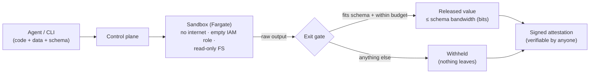

# Keyhole

**Let untrusted code read your private data — and let only a small, signed answer out.**

You can look through a keyhole; you can't carry the furniture out through it. Keyhole runs
untrusted or AI-generated code on sensitive data, but the only thing that may leave is a value you
declared in advance (a label, a score, a count) — sized in **bits**, enforced outside the code's
reach, and recorded in a **signed receipt** anyone can verify.

## The problem

A hospital wants a vendor's model to score its patient records. A bank wants a fraud vendor's code
to run over its transactions. An AI agent wants to write and run a script over your customer table.
In every case, someone must currently hand over their crown jewels: the data owner ships the data,
or the code owner ships the code — and with AI agents, the code was written seconds ago and nobody
has reviewed it.

Running that code in a sandbox doesn't fix this. A sandbox stops code from **escaping the box**; it
then hands back **whatever the code returns**. If the code read your customer table, the customer
table can walk out inside the answer.

## Why existing tools don't cover it

| Approach | What it protects | Why it misses this case |
|---|---|---|
| Code sandboxes (E2B, Modal, AWS AgentCore) | the **host** from the code | output is returned unrestricted, so data leaks through it |
| Confidential computing / TEEs (Nitro Enclaves, SGX) | data from the **operator** | the code inside the enclave can still return the data |
| Data clean rooms | data from **queries** | restrict SQL-style analyses, not arbitrary code |
| DLP / content scanning | known **patterns** in output | defeated by encrypting or encoding before emitting |
| Differential privacy | individuals in **aggregates** | needs a statistical query model, not general code |

Keyhole takes a known idea — bounded information leakage, from information-flow research and the
confinement problem (Lampson, 1973) — and makes it a practical primitive for the case none of these
cover: **arbitrary code, on private data, with a receipt.**

## The idea in one number

Before the code runs, the caller declares the shape of the answer, e.g.
`{"type": "enum", "choices": ["spam", "ham", "other"]}`. Three possible answers can carry at most
log₂3 = **1.58 bits**. The example customer file is **3,312 bits**. It does not fit — no matter how
cleverly it's encoded, because this is a limit on *size*, not a search for *content*.

```bash
sbx run examples/classify.py --data customers.csv=examples/customers.csv \
    --schema schemas/label.json --local
# → status: succeeded   output: "spam"   bandwidth: 1.58 bits

sbx run examples/exfil.py --data customers.csv=examples/customers.csv \
    --schema schemas/label.json --local
# → status: withheld    output does not conform to the declared schema   (nothing released)
```

On top of that one idea:

- **A bit budget per caller.** Asking many small questions could add up, so each caller has a
  cumulative cap on released bits (`--principal mallory --budget-bits 8`).
- **A signed receipt for every run.** The attestation binds the hashes of the code, data and schema,
  the exact output, and who was involved. Change one field and verification fails.
- **A locked-down cloud.** On AWS the code runs on Fargate in a subnet with no internet route, an
  empty IAM role and a read-only filesystem; the receipt is signed by a KMS key that never leaves KMS.
- **Two-party clean room.** A data owner grants a partner the right to run code on a dataset the
  partner never receives.

## See it

```bash
python -m pip install -e '.[dev]'
make showtime              # paced visual walkthrough of everything above (~3 min)
make showtime-dashboard    # second terminal: the same runs in the browser
```

`make demo` is the 10-second, non-interactive version.

## How it works



The code runs in one trust domain; the **exit gate** runs in another. The code has full freedom
inside the box and no authority over the gate, so it can't change the schema it's judged by. The
gate checks, in order: does the output fit the schema → how many bits could it carry → does a
secondary DLP scan flag it → is the caller within budget → release, and sign a receipt either way.

## What it guarantees — and what it doesn't

Keyhole never claims "zero leakage": the confinement problem proves that's impossible for code that
can see the data. It claims a **disclosed ceiling**.

- **Guaranteed:** a released answer carries at most the schema's bandwidth; anything that doesn't
  fit is withheld; every run is signed and tamper-evident.
- **Bounded, not zero:** code can choose *which* allowed answer to give, leaking up to the schema's
  bits per run. The per-caller budget caps the total of released answers.
- **Known gap:** run *status* is a side channel. A failed run reports its exit code and is not
  charged to the budget, so code could signal through how it fails. Fix planned: collapse every
  non-release outcome into one opaque status and charge every run.
- **Out of scope:** timing side channels, what a legitimate answer itself reveals, and breaking
  AWS's own isolation. See [`SECURITY.md`](SECURITY.md).

## Use cases

- An AI agent analyzing private data it should never be able to take away.
- Two-party computation: hospital records × vendor model, bank transactions × fraud vendor, ad
  measurement.
- Untrusted marketplace plugins running over user data.
- Scoring a model against a secret benchmark without revealing the benchmark.

The rule of thumb: Keyhole fits when **the data is more sensitive than the answer is large.**

## Usage

### Multi-party clean room

```bash
# Data owner: register a dataset, then grant a specific code provider.
sbx dataset add customers.csv=./customers.csv --owner acme      # → ds-1eebc2b917c4
sbx dataset grant ds-1eebc2b917c4 --to partner-ai               # → grant-…

# Code provider: run by dataset id + grant. They never receive the bytes.
sbx run classify.py --dataset ds-1eebc2b917c4 --grant grant-… \
    --principal partner-ai --schema schemas/label.json
# → succeeded   output: "spam"   attestation binds {acme, partner-ai, ds-1eebc2b917c4}

# Anyone else holding the same token is refused before anything runs:
sbx run classify.py --dataset ds-1eebc2b917c4 --grant grant-… --principal intruder …
# → refused: grant does not authorize provider 'intruder'
```

This is a local MVP of the model: grants are unguessable bearer tokens (production would sign and
time-box them), and owner/provider separation is enforced by the control plane rather than by IAM.

### Verify a receipt

```bash
sbx run … --save-attestation att.json
sbx verify att.json                         # VALID   (local ed25519 dev key)
sbx verify att.json --pubkey kms.pem        # VALID   (cloud: ecdsa-p256 via KMS)
```

### From an AI agent (MCP)

The MCP server exposes `run_confidential_tool`: an agent supplies code, data and a narrow schema,
and gets back only the conforming value plus an attestation id — the same exit gate as everywhere.

```bash
pip install -e '.[mcp]'
claude mcp add keyhole -- keyhole-mcp       # Claude Code
```

Any other MCP host: `{ "mcpServers": { "keyhole": { "command": "keyhole-mcp" } } }`

### Deploy to your AWS account

```bash
infra/terraform/environments/dev/stack.sh up     # build, terraform apply, push sandbox image
export KEYHOLE_API_ENDPOINT=…                    # printed by `up`
sbx run classify.py --data emails.csv=./emails.csv --schema schemas/label.json \
    --save-attestation att.json                  # submit → poll → released + KMS-signed
sbx verify att.json --pubkey /tmp/kms.pem
infra/terraform/environments/dev/stack.sh down   # back to ≈ $0
```

Lambda + API Gateway control plane, DynamoDB audit log, Fargate sandbox, KMS signing key. About
$0.03/hour while up (VPC endpoints), ≈ $0 when torn down. `stack.sh` reads AWS keys from the
repo-root `.env` (`AWS_ACCESS_KEY`, `AWS_SECRET_KEY`).

### Dashboard

`sbx dashboard` serves a read-only, self-contained viewer of local runs (`~/.keyhole`) on
http://127.0.0.1:8787 — no framework, no CDN. Its centerpiece is the **exit aperture**, a log-scale
gauge from 1 bit to 1 MB, so a bounded exit reads as the sliver it is. Drop an attestation file on
it to verify.

## Status

- **Local:** full pipeline — typed exit, bandwidth accounting, exit gate, DLP backstop, ed25519
  attestation, budget, clean room, MCP server, dashboard.
- **Cloud:** deployed and verified end to end on real AWS — honest answer released and KMS-signed,
  exfiltrator withheld, sandbox internet probe blocked, attestation VALID against the KMS public key.
- **Adversarial:** `tests/hostile/` attacks every claim — bulk dump, encoding into a bounded string,
  stdout, fork bomb, memory hog, drip across runs, clean-room intruder and cross-principal exfil,
  attestation tamper.

Next: see [`docs/FUTURE-SCOPE.md`](docs/FUTURE-SCOPE.md).

## Layout

| Path | What |
|---|---|
| `src/keyhole/schema/` | The narrow exit and its bandwidth accounting — the core guarantee. |
| `src/keyhole/controlplane/gate.py` | The exit gate: validate → bandwidth → DLP → budget → release → sign. |
| `src/keyhole/attest/` | Signed, verifiable attestations (ed25519 locally, KMS in the cloud). |
| `src/keyhole/executor/` | Local executor matching the cloud contract. |
| `src/keyhole/cli/`, `src/keyhole/mcp/` | CLI (`sbx`) and MCP server. |
| `infra/terraform/` | AWS deploy (no NAT; ≈ $0 idle). |
| `tests/hostile/` | Hostile scripts that try to exfiltrate — and can't. |
| `docs/book/` | The decision book: every design choice and why. |
| `STUDY-GUIDE.md`, `DEMO.md` | Interview prep and the live-demo runbook. |

## Develop

```bash
python -m pip install -e '.[dev]'
make test        # unit + hostile suite
make lint
sbx doctor       # check your environment
```

## License

MIT.
