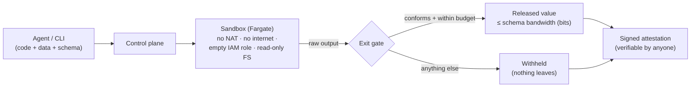

# Mark-1

**Confidential code execution with a bandwidth-bounded, attested exit.**

Run untrusted or AI-generated code on your private data in the cloud, and get back **only a small,
typed, cryptographically-attested answer** — so the data *structurally* cannot leave.

```bash
# Classify some private emails without letting the code exfiltrate them.
sbx run classify.py --data emails.csv=./emails.csv --schema schemas/label.json --local
# → status: succeeded   output: "spam"   bandwidth: 1.58 bits   attestation: att-…

# A script that tries to dump the whole dataset instead:
sbx run exfil.py --data emails.csv=./emails.csv --schema schemas/label.json --local
# → status: withheld    output does not conform to the declared schema  (nothing released)
```

## Why it's different

Isolation-first sandboxes (E2B, Modal, AWS AgentCore) stop code from **escaping the box** — they
protect the *host* from the code. They do nothing to stop code that legitimately reads your data
from **leaking** it. Mark-1 protects the **data** from the code:

- Untrusted code may return **only** a value matching a caller-declared **narrow schema** (int /
  enum / bounded string / bounded array / small object). A few-byte exit makes **bulk exfiltration
  structurally impossible** — a bandwidth argument, not a content scan that encrypt-before-emit
  defeats.
- Every run emits a **signed attestation**: *this exact code ran on this exact data with zero
  egress, and only this bounded value came out* — verifiable by anyone.
- A **cumulative exit-bandwidth budget** (`--principal alice --budget-bits 8`) caps the *total*
  bits a caller can ever extract across runs, so drip exfiltration over many conforming calls is
  bounded too — not just each run.
- Deploys into **your own AWS account** with one `terraform apply`. Designed for < ~$10/month, ≈ $0
  idle. An MCP server lets AI agents use it directly.

Built on the confinement problem (Lampson, 1973): we never claim "zero leak." We claim the leak is
**bounded to the schema you chose and disclosed in the attestation.** See [`SECURITY.md`](SECURITY.md).

## Status

The base (M0–M8) is complete and verified:

- **Local:** the full pipeline (typed exit, bandwidth accounting, exit gate, DLP backstop, ed25519
  attestation, cumulative budget) runs today via `sbx run --local`, `make demo`, and the MCP server.
- **Cloud:** a full **deployable API** — `terraform apply` stands up a Lambda + API Gateway control
  plane, DynamoDB (append-only audit), and a **KMS signing key** (the attestation private key never
  leaves KMS). `sbx run` (without `--local`) submits to the API and polls to completion. Proven
  end-to-end on real AWS — honest answer released + KMS-attested, exfiltrator withheld, attestation
  **VALID** against the exported KMS public key — all inside a no-NAT private subnet with an
  endpoints-only security group and an **empty task IAM role**. Tears down to zero (idle ≈ $0 apart
  from the ~$1/mo KMS key; a run costs pennies).
- **Adversarial:** `tests/hostile/` (dump, encode-in-bounded-string, stdout, fork bomb, memory hog,
  drip-exfiltration-across-runs) all structurally blocked; the MCP transport is integration-tested
  end-to-end.

Remaining work is [future scope](docs/FUTURE-SCOPE.md), not the base guarantee.

## How it fits together



<details>
<summary><b>Demo transcript</b> (<code>make demo</code> — same dataset, same schema, two programs)</summary>

```text
Mark-1 local demo — same dataset, same schema, two programs
dataset: 20279 bytes; exit schema: 3-way enum (~1.58 bits)

[honest classifier]
  status:      succeeded
  output:      'spam'
  bandwidth:   1.58 bits (max that could leave)
  attestation: att-ec16dec137624dcf8d6ac6cf285eba73  (signature VALID)

[malicious exfiltrator]
  status:      withheld
  output:      None
  withheld:    output does not conform to the declared schema: $: value not among enum choices
  bandwidth:   1.58 bits (max that could leave)
  attestation: att-72eafb3418f647918b42592f239f76bd  (signature VALID)

The dataset is ~20279 bytes; the widest the exit can carry is ~1.58 bits.
Bulk exfiltration is structurally impossible, not merely scanned-for.
```

</details>

## Use from an AI agent (MCP)

The MCP server exposes `run_confidential_tool`: an agent supplies untrusted code, the data, and a
narrow output schema, and gets back only the schema-conforming value plus an attestation id — the
same exit gate as everywhere else, so the guarantee is identical.

```bash
pip install -e '.[mcp]'
claude mcp add mark1 -- mark1-mcp        # Claude Code
```

Any other MCP host, via generic stdio config:

```json
{ "mcpServers": { "mark1": { "command": "mark1-mcp" } } }
```

## Deploy the cloud API (your AWS account)

```bash
make lambda-zip                                    # build dist/controlplane.zip
cd infra/terraform/environments/dev
terraform apply -var enable_control_plane=true -var enable_egress_endpoints=true
#   → outputs: api_endpoint, kms_key_id, …   (push the sandbox image to the ECR repo once)

export MARK1_API_ENDPOINT="https://<id>.execute-api.<region>.amazonaws.com/"
sbx run classify.py --data emails.csv=./emails.csv --schema schemas/label.json \
    --save-attestation att.json                    # submit → poll → released + KMS-attested
aws kms get-public-key --key-id <kms_key_id> ...   # export the public key as PEM
sbx verify att.json --pubkey kms.pem               # VALID, algorithm: ecdsa-p256-sha256
```

The KMS signing key is ~$1/month; Lambda + API Gateway + DynamoDB are free/pennies at this scale.
`terraform destroy` returns the account to ≈ $0.

## Dashboard

`sbx run --local` records each run under `~/.mark1`; `sbx dashboard` serves a self-contained,
read-only viewer of that history — no web framework, no CDN, no external requests. Its signature
element is the **exit-bandwidth aperture**: a log-scale gauge that plots a run's exit bits against
`1 bit → 1 KB → 1 MB`, so a bounded exit reads as the sliver it is.

```text
 MARK·1   run evidence                          ● released  ● withheld  ● failed
┌────────────────────────────┬──────────────────────────────────────────────────┐
│ RUN LEDGER            3 runs│  VERDICT                                          │
│ ┌────────────────────────┐ │  Released   [succeeded]  run-042f…      ✓ VALID   │
│ │ 042f19b1  [SUCCEEDED]  │ │                                                   │
│ │ 4.75 bits    ✓ VALID   │ │  EXIT APERTURE          4.75 bits could leave     │
│ ├────────────────────────┤ │  ├────────▮──────────────────────────────────┤   │
│ │ 33c9e772  [WITHHELD]   │ │  1 bit   1 B        1 KB                 1 MB      │
│ │ 1.58 bits    ✓ VALID   │ │                                                   │
│ ├────────────────────────┤ │  BOUND HASHES — ed25519                           │
│ │ 2ba7ca67  [SUCCEEDED]  │ │  code    3f2a…   data  9c1d…   schema  7b0e…      │
│ │ 1.58 bits    ✓ VALID   │ │  DATA-FLOW RECORD ·  output_written               │
│ └────────────────────────┘ │  VERIFY  ⤓ drop an attestation.json to check      │
└────────────────────────────┴──────────────────────────────────────────────────┘
```

```bash
sbx dashboard            # → http://127.0.0.1:8787   (Ctrl-C to stop)
```

## Multi-party clean room

The strongest form of the thesis: *let an external party's AI run on **your** data, and get proof
of exactly what left.* The data-owner and the code-provider are separate principals — the provider
references the dataset by id and **never receives the bytes**, and the attestation binds both
identities plus the dataset hash.

```bash
# Data-owner: register a dataset, then grant a specific code-provider.
sbx dataset add customers.csv=./customers.csv --owner acme      # → ds-1eebc2b917c4
sbx dataset grant ds-1eebc2b917c4 --to partner-ai               # → grant-… (a bearer token)

# Code-provider: run against the dataset by id + grant. They never see the data.
sbx run classify.py --dataset ds-1eebc2b917c4 --grant grant-… \
    --principal partner-ai --schema schemas/label.json
# → succeeded   output: "spam"   attestation binds {acme, partner-ai, ds-1eebc2b917c4}

# An un-granted provider is refused before anything runs:
sbx run classify.py --dataset ds-1eebc2b917c4 --grant grant-… --principal intruder …
# → refused: grant does not authorize provider 'intruder' (nothing ran; data never materialized)
```

The owner can then `sbx verify` the returned attestation: *provider `partner-ai` ran this code on
dataset `ds-1eebc2b917c4` (hash matches what I registered), zero egress, and only `"spam"` came out.*
This is a **local MVP** of the model — grant tokens are unguessable bearer capabilities (a
production grant would be signed and time-boxed), and infra-level principal separation (the
provider's IAM cannot read the dataset's S3) is the noted cloud hardening step.

## Layout

| Path | What |
|---|---|
| `src/mark1/schema/` | The typed narrow exit + bandwidth accounting — the core guarantee. |
| `src/mark1/attest/` | Signed, verifiable attestations. |
| `src/mark1/controlplane/gate.py` | The exit gate: validate → bandwidth → backstop → attest → release. |
| `src/mark1/executor/` | Local executor (fast dev loop) matching the cloud contract. |
| `src/mark1/cli/`, `src/mark1/mcp/` | Thin CLI and MCP clients. |
| `infra/terraform/` | One-command AWS deploy (no NAT; ≈ $0 idle). |
| `images/` | Sandbox + egress-proxy container images. |
| `tests/hostile/` | The marquee: hostile scripts that try to exfiltrate — and can't. |
| `docs/book/` | The decision book: every design choice and why. |
| `docs/FUTURE-SCOPE.md` | The roadmap of future features. |

## Develop

```bash
python -m pip install -e '.[dev]'
make test        # unit + hostile suite
make lint
sbx doctor       # check your environment
```

## License

MIT.
